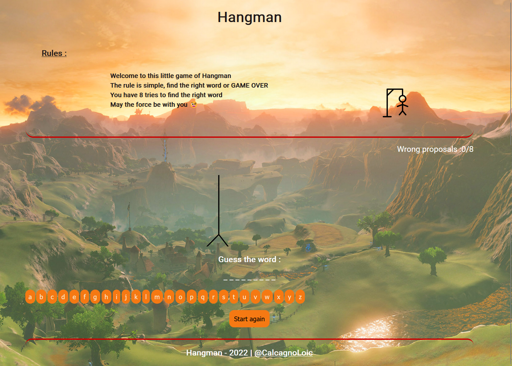

<h1 align="center">Hangman App </h1>

Small hangman game application. The goal is simple, find the word in 8 tries otherwise it's lost!

    
    
    
    

## Authors

- [@CalcagnoLoic](https://github.com/CalcagnoLoic)